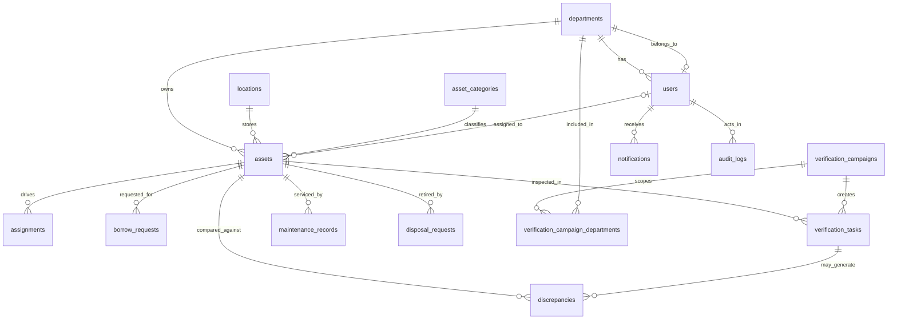
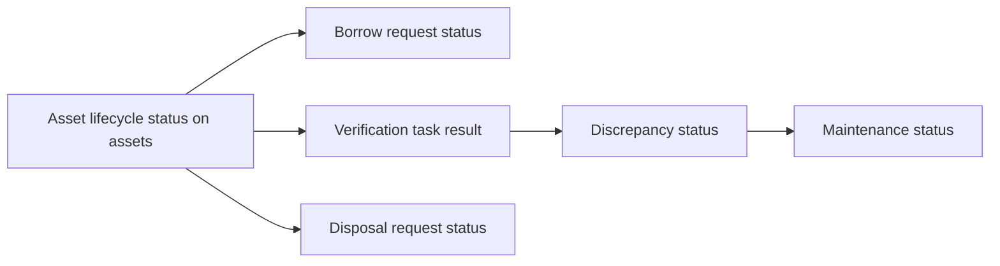

# Database Design

## Design Intent

The schema is intentionally asset-centric. Assets act as the operational anchor, while workflow tables capture how those assets are assigned, borrowed, verified, repaired, investigated, and disposed.

That structure supports three important goals:

1. A single asset can be traced across multiple workflows.
2. Role and scope logic can be derived from existing relationships rather than a separate ACL schema.
3. Dashboards, reports, audit trails, and search can all reuse the same normalized operational model.

## Entity Relationship View

## Core Entity Groups

| Group | Tables | Why they exist |
| --- | --- | --- |
| Reference data | `departments`, `locations`, `asset_categories` | Stabilize repeated business labels and codes |
| Identity and security context | `users` | Store role, department, account status, and profile details |
| Asset master data | `assets` | Hold the current source of truth for each managed asset |
| Operational workflows | `assignments`, `borrow_requests`, `verification_campaigns`, `verification_tasks`, `discrepancies`, `maintenance_records`, `disposal_requests` | Record lifecycle actions around an asset |
| Cross-cutting traceability | `notifications`, `audit_logs` | Capture user-facing events and audit history |

## Why the Schema Is Structured This Way

### Asset-centric workflow modeling

- Every major workflow references `assets`.
- This avoids duplicated "asset snapshot" tables for each module.
- Search and reporting can summarize activity by asset without cross-module reconciliation.

### Normalization choices

- Departments, locations, and categories are normalized because their codes and names recur across multiple tables.
- Users reference departments instead of denormalized department names.
- Verification campaign scope is many-to-many because one campaign may span several departments.

### Scope modeling choices

- The system does not store per-record ACL rows.
- Instead, scope is derived from role plus relationships already present in the model:
  - `assets.department_id`
  - `assets.assigned_to_user_id`
  - workflow requester/reviewer/assignee references
  - campaign-department associations
- This reduces data duplication while still supporting scoped reads and workflow ownership checks.

## Main Entities and Rationale

### `users`

- Holds role, status, department, contact fields, and account state.
- `username` and `email` are unique because they are business identifiers and login/communication channels.
- `department_id` supports scope checks for managers and department-owned workflows.

### `assets`

- Stores category, department, current location, assignee, physical condition, and lifecycle state.
- `lifecycle_status` is stored directly on the asset because dashboards and search need the current state without joining every workflow.
- `serial_number` is unique when present because it represents a real-world identifier.

### `assignments`

- Records transfer or allocation history.
- Includes both source and destination department/user references where applicable.
- This preserves lineage instead of mutating asset ownership history in place.

### `borrow_requests`

- Represents a time-bound approval workflow.
- Keeps requester, department, approver, dates, notes, and decision timestamps in one record.
- Status is stored directly because it represents the business workflow state.

### `verification_campaigns` and `verification_tasks`

- Campaigns model the verification event and its scope.
- Tasks model per-asset verification work and store expected vs observed values.
- The split between campaign and task supports dashboards, campaign-level progress, and asset-level findings.

### `discrepancies`

- Captures mismatches discovered from verification.
- Stores type, severity, status, expected value, observed value, root cause, and resolution.
- Linked to both the campaign and the verification task to preserve traceability.

### `maintenance_records`

- Tracks support work against an asset.
- Stores technical condition, priority, status, assignee, schedule, completion, and cost.
- This allows both planning and post-work review.

### `disposal_requests`

- Represents retirement/review actions against an asset.
- Keeps the proposer, reviewer, effective date, estimated value, and notes.

### `notifications` and `audit_logs`

- Notifications are user-facing and unread/read aware.
- Audit logs are append-only and system-facing for traceability and reporting.
- Both use flexible `entity_type` and `entity_id` values because they must point to multiple workflow tables.

## Workflow State Modeling

Why state is distributed this way:

- `assets.lifecycle_status` answers "what is the asset's current business posture?"
- workflow statuses answer "what is happening in this specific process?"
- this prevents every screen from inferring current state through indirect joins

## Constraints and Indexing Strategy

### Important constraints

- Unique business identifiers:
  - `users.username`
  - `users.email`
  - `asset_categories.code`
  - `assets.code`
  - `assets.serial_number`
  - `verification_campaigns.code`
- Foreign keys preserve referential integrity across workflows and masters.

### Key indexes and why they matter

| Index area | Why it matters |
| --- | --- |
| `idx_users_department`, `idx_users_role` | Admin filtering, role lookups, and department scope |
| `idx_assets_department`, `idx_assets_assigned_to_user`, `idx_assets_lifecycle_status` | Asset list filters, dashboards, assignee scope |
| `idx_assignments_asset`, `idx_assignments_to_user` | Assignment history lookups |
| `idx_borrow_requests_requester`, `idx_borrow_requests_status` | Request queues and self-service history |
| `idx_verification_tasks_campaign`, `idx_verification_tasks_assigned_to_user` | Campaign progress and workload queries |
| `idx_discrepancies_asset`, `idx_discrepancies_status` | Investigation lists |
| `idx_maintenance_records_asset`, `idx_maintenance_records_assigned_to_user` | Technician queues and asset repair history |
| `idx_disposal_requests_asset` | Disposal review lookups |
| `idx_notifications_recipient` | Notification inbox performance |
| `idx_audit_logs_created_at` | Recent-first audit reporting |

## Normalization Tradeoffs

### Benefits accepted

- Cleaner reference data reuse
- Lower risk of inconsistent department/category/location labels
- Easier reporting joins

### Tradeoffs accepted

- Some screens require joins to render business-friendly labels
- Scope logic remains in services rather than purely in the database
- Polymorphic references in audit/notification tables trade FK strictness for cross-module flexibility

## Why the Schema Fits RBAC and Search

- Managers can be scoped by `department_id`.
- Employees can be scoped by `assigned_to_user_id` or request ownership.
- Verification visibility can be derived from campaign-department links.
- Search can aggregate results from existing service queries because the necessary identifiers and display fields already exist in the current schema.
