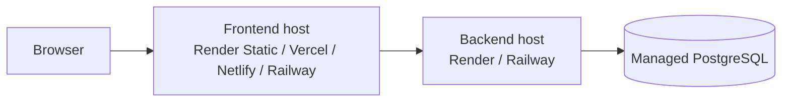

# Deployment Readiness Review

## Readiness Summary

| Area | Current state | Notes |
| --- | --- | --- |
| Frontend dev/runtime config | Ready | Uses `VITE_API_BASE_URL` and `VITE_APP_BASE_PATH` |
| Frontend production build | Ready | Verified with `npm --prefix frontend run build` |
| Backend build/tests | Ready | Verified with `mvn verify` |
| Database portability | Ready with env vars | Supports `DB_URL` or `DB_HOST` + `DB_PORT` + `DB_NAME` |
| JWT configuration | Safer than before | Production profile disables demo-secret usage unless overridden |
| CI quality gates | Ready | Backend verify, frontend unit tests, frontend build, Playwright smoke |
| Static-only hosting | Partial | Frontend can be hosted statically, but backend must live elsewhere |
| GitHub Pages | Limited | Separate backend required and SPA rewrite handling is still needed |

## Supported Deployment Patterns

### Pattern A: Split-host deployment

Frontend and backend are deployed separately.

Examples:

- frontend on Vercel, Netlify, or a static host
- backend on Render or Railway
- PostgreSQL on Render, Railway, Neon, Supabase, or another managed provider

Requirements:

- set `VITE_API_BASE_URL` to the backend public origin
- set backend `CORS_ALLOWED_ORIGINS` to the frontend public origin
- provide a real `JWT_SECRET`

### Pattern B: Same-origin reverse proxy deployment

Frontend and backend are served behind the same domain, with the platform or ingress routing `/api` to the backend.

Benefits:

- frontend can keep same-origin API calls
- CORS becomes simpler
- no rebuild needed for API origin changes if the reverse proxy stays consistent

### Pattern C: Local or demo Docker stack

Current `docker-compose.yml` remains suitable for local demos and smoke tests.

## Required Environment Variables

### Frontend

| Variable | Required when | Purpose |
| --- | --- | --- |
| `VITE_API_BASE_URL` | split-host deployment | public backend origin, for example `https://api.example.com` |
| `VITE_APP_BASE_PATH` | sub-path hosting | router and build base, for example `/asset-management/` |
| `VITE_API_PROXY_TARGET` | local Vite dev only | proxy target for `/api` during local development |

### Backend

| Variable | Required when | Purpose |
| --- | --- | --- |
| `SERVER_PORT` | optional | backend port |
| `DB_URL` or `DB_HOST` + `DB_PORT` + `DB_NAME` | always | PostgreSQL connection |
| `DB_USERNAME` | always | database user |
| `DB_PASSWORD` | always | database password |
| `JWT_SECRET` | always outside local demos | JWT signing secret |
| `JWT_ALLOW_DEMO_SECRET` | deployment | set to `false` |
| `JWT_EXPIRATION_SECONDS` | optional | token lifetime |
| `CORS_ALLOWED_ORIGINS` | split-host deployment | allowed frontend origins |

## Production Profile Expectations

The backend now includes `application-prod.properties` with:

- `app.security.jwt.allow-demo-secret=false`
- reduced SQL formatting noise

Practical guidance:

- set `SPRING_PROFILES_ACTIVE=prod` in real deployments
- also provide a real `JWT_SECRET`

## Platform-by-Platform Notes

## Render

Recommended topology:

- Web Service for backend
- PostgreSQL database
- Static Site for frontend

Configuration notes:

- backend env: `SPRING_PROFILES_ACTIVE=prod`, database vars, `JWT_SECRET`, `CORS_ALLOWED_ORIGINS`
- frontend env: `VITE_API_BASE_URL=https://<render-backend-host>`
- good fit because Render supports both web services and static frontend hosting

## Railway

Recommended topology:

- backend service on Railway
- PostgreSQL on Railway
- frontend on Railway static hosting or an external static host

Configuration notes:

- if frontend is hosted elsewhere, set `VITE_API_BASE_URL` to the Railway backend URL
- ensure Railway public domain is added to backend CORS config

## GitHub Pages

Status: possible for the frontend only, but not recommended as the main deployment target.

Why:

- GitHub Pages cannot host the Spring Boot backend
- the app uses BrowserRouter and therefore needs SPA rewrite behavior
- `VITE_APP_BASE_PATH` helps with sub-path builds, but GitHub Pages still needs a route fallback strategy

Practical conclusion:

- GitHub Pages is acceptable only for a static frontend showcase backed by an externally hosted API and additional SPA routing handling
- Render, Railway, Vercel, or Netlify plus a hosted backend is a smoother option

## Vercel or Netlify

Status: strong fit for the frontend.

Requirements:

- set `VITE_API_BASE_URL` to the backend host
- configure SPA rewrites on the platform
- keep backend deployed elsewhere

## Deployment Diagram

## Remaining Gaps and Recommendations

### Resolved in this phase

- hardcoded frontend localhost assumptions reduced through env config
- sub-path router support added
- backend JWT demo-secret behavior made safer for production
- frontend build validation added to CI

### Still to decide in a real deployment

- actual public frontend URL
- actual public backend URL
- final CORS origin list
- managed PostgreSQL provider
- whether the deployment will be split-host or same-origin behind a reverse proxy

## Recommended Real-World Deployment Path

For the smoothest deployment story, use:

1. backend on Render or Railway
2. PostgreSQL on the same platform or another managed provider
3. frontend on Render Static Site, Vercel, or Netlify
4. `VITE_API_BASE_URL` pointed at the backend public URL
5. backend `SPRING_PROFILES_ACTIVE=prod` and `JWT_ALLOW_DEMO_SECRET=false`
