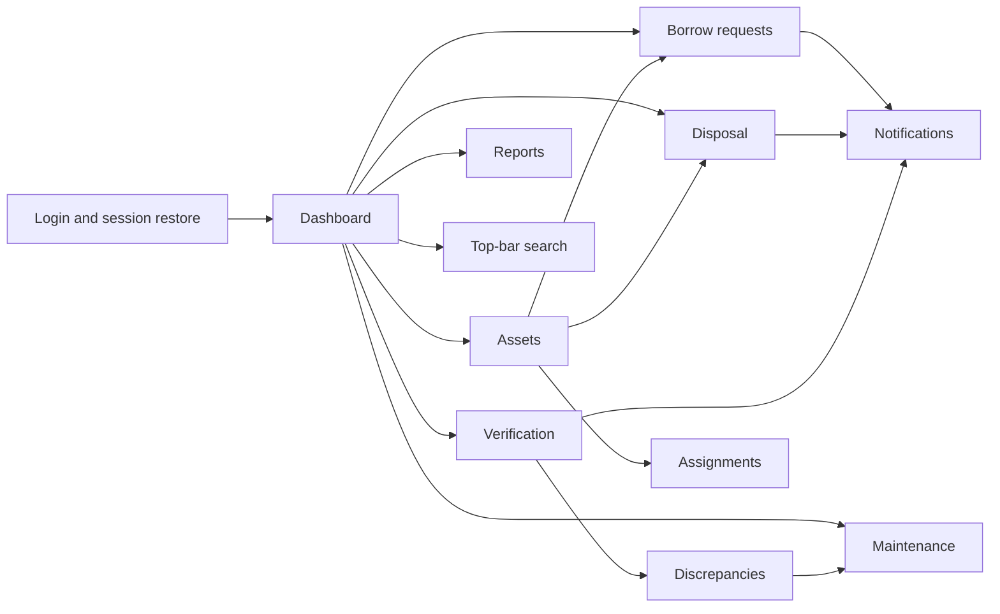
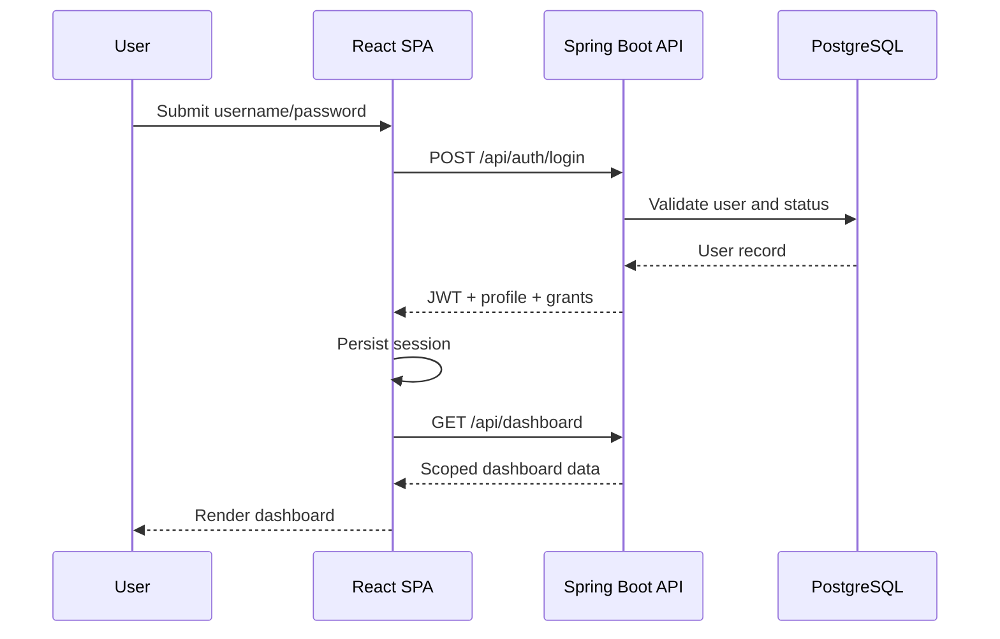
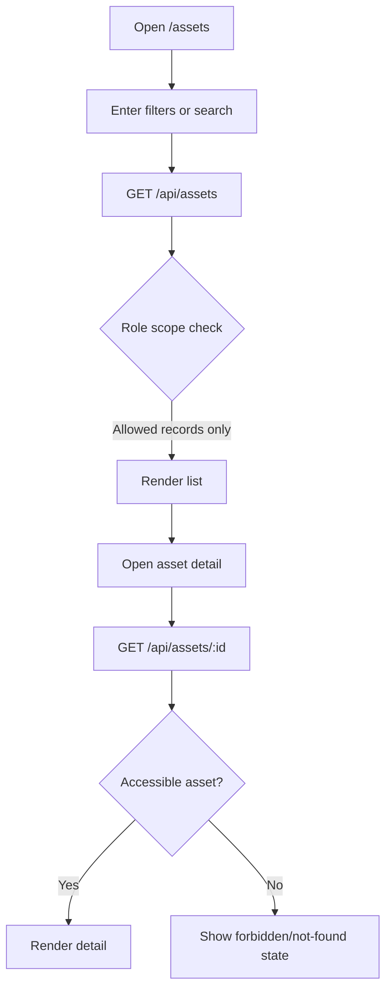
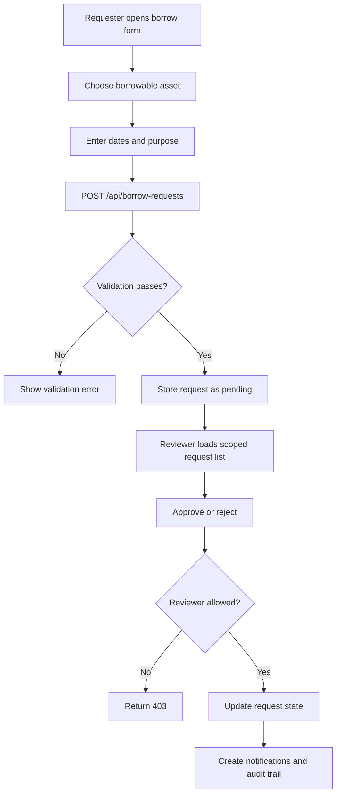
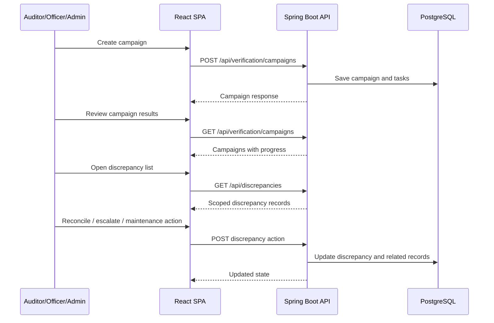
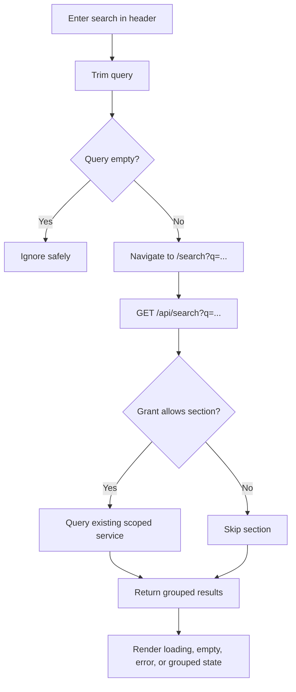

# Functional Flows

## Flow Map

## Authentication and Session Bootstrap

### Trigger

User opens `/login` or refreshes the app with a stored session.

### Actors

All roles.

### Main steps

1. Login page collects credentials or a stored token is restored.
2. Backend authenticates or validates the session.
3. Frontend stores the token and current user.
4. Protected routes become available according to grants.

### Validations

- active account required
- valid token required for protected API calls

### Success outcome

- user reaches the correct dashboard with role-appropriate navigation

### Failure outcome

- login error, session clear, or redirect to `/login`

### Role restrictions

- none at entry; role determines what happens after authentication

## Dashboard by Role

### Trigger

Authenticated user lands on `/`.

### Actors

All authenticated roles.

### Main steps

1. Backend resolves current user and scope.
2. Dashboard cards and activity are assembled from visible data.
3. Frontend shows role-appropriate quick actions.

### Validations

- `dashboard.read` grant required

### Success outcome

- user sees a scoped operational overview

### Failure outcome

- redirect or forbidden access handling

### Role restrictions

- every role can view the dashboard, but counts and actions are scope-specific

## Asset Browsing and Detail Flow

### Trigger

User opens `/assets` or an asset detail page.

### Actors

All roles with asset read access.

### Main steps

1. User enters filters and loads the asset list.
2. Backend enforces role and ownership scope.
3. User opens a visible asset detail page.
4. Privileged users can continue into create or edit flows.

### Validations

- reference IDs must be valid for create/update
- unique asset code and serial constraints

### Success outcome

- user sees accurate asset inventory within permitted scope

### Failure outcome

- empty state, validation errors, or access denial

### Role restrictions

- Admin/Officer/Auditor/Technician broad read
- Manager department scope
- Employee own assignment or borrowable department scope

## Assignment Review Flow

### Trigger

User opens `/assignments`.

### Actors

Admin, Officer, Manager, Employee.

### Main steps

1. User searches assignment history.
2. Backend limits visible rows by destination scope.
3. User reviews transfer type, status, and effective dates.

### Validations

- assignment visibility follows recipient or department scope

### Success outcome

- visible chain of responsibility for eligible assets

### Failure outcome

- empty list or forbidden response

### Role restrictions

- Employee sees only own assignments
- Manager sees assignments into their department

## Borrow Request Flow

### Trigger

Requester creates a borrow request or reviewer opens the borrow queue.

### Actors

Requester: Admin, Officer, Manager, Employee.  
Reviewer: Admin, Officer, Manager.

### Main steps

1. Requester selects an asset and enters dates/purpose.
2. Backend validates borrowability and workflow constraints.
3. Request is stored.
4. Reviewer loads scoped requests.
5. Reviewer approves or rejects.
6. Notifications and audit data are updated.

### Validations

- asset must be borrowable
- request cannot conflict with active borrow workflow
- date range must make sense
- reviewer must match department/broad approval scope

### Success outcome

- request progresses through a real review lifecycle

### Failure outcome

- invalid input, state conflict, or permission denial

### Role restrictions

- Auditor can read borrow requests but does not approve them

## Verification and Discrepancy Flow

### Trigger

Verification-capable user creates or reviews a campaign; discrepancy-capable user investigates findings.

### Actors

Admin, Officer, Auditor, Manager.

### Main steps

1. Create campaign with departments and dates.
2. Backend creates verification tasks.
3. Users review campaign progress.
4. Discrepancies are investigated and progressed.
5. Some outcomes hand work to maintenance.

### Validations

- unique campaign code
- due date on/after start date
- campaign must include departments
- discrepancy state transitions must be valid

### Success outcome

- control work is visible, trackable, and actionable

### Failure outcome

- invalid campaign payload, invalid discrepancy transition, or scope denial

### Role restrictions

- Manager sees campaign/discrepancy data only when the relevant department is in scope

## Maintenance Flow

### Trigger

User opens `/maintenance` or creates a maintenance record.

### Actors

Admin, Officer, Technician, Manager, Employee.

### Main steps

1. Maintenance-capable user creates or reviews work.
2. Backend validates assignee, asset, dates, priority, and status.
3. Record is stored and appears in the maintenance queue.
4. Technician or scoped viewers track the work.

### Validations

- asset must exist
- assignee must be valid
- dates and status must be consistent

### Success outcome

- support work is scheduled and attributable

### Failure outcome

- invalid payload or unauthorized action

### Role restrictions

- Technician can manage maintenance
- Employee can only read maintenance tied to their assigned assets

## Disposal Flow

### Trigger

User opens `/disposal`.

### Actors

Admin, Officer, Manager.

### Main steps

1. Reviewer opens disposal requests.
2. Reviewer chooses approve, reject, or defer.
3. Backend validates scope and updates the record.

### Validations

- request must exist
- reviewer must have correct scope

### Success outcome

- disposal progresses with preserved reviewer traceability

### Failure outcome

- invalid state or permission denial

### Role restrictions

- Managers only act inside their department

## Notifications and Profile Flow

### Trigger

User opens `/notifications` or `/profile`.

### Actors

All authenticated users.

### Main steps

1. Notifications are loaded for the current user only.
2. User marks individual or all notifications as read.
3. User edits phone or bio in the profile page.
4. Backend persists self-owned updates only.

### Validations

- notification ownership must match current user
- profile update is self-only

### Success outcome

- personal queue and profile data stay current

### Failure outcome

- ownership failure or generic API error

### Role restrictions

- no cross-user notification or profile access

## User Management, Reports, and Search Flow

### Trigger

Admin opens `/users`; privileged users open `/reports`; any authenticated user uses header search.

### Actors

Admin for users, Admin/Officer/Manager/Auditor for reports, all authenticated roles for search.

### Main steps

1. Admin manages users and reference-backed user details.
2. Privileged users review report summaries and audit logs.
3. Header search navigates to the search page.
4. Backend gathers real, grouped, RBAC-aware search results from existing services.

### Validations

- username/email uniqueness
- user-management actions restricted to admin
- search query must not be blank

### Success outcome

- governance and discovery tasks are completed with real data

### Failure outcome

- validation errors, forbidden access, or visible search error state

### Role restrictions

- users section in search only appears for `users.manage` callers
- each search section is independently gated by module grants
