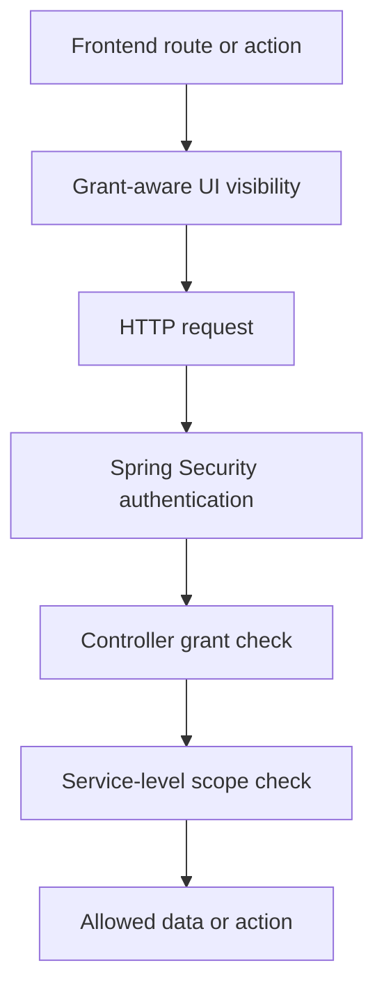
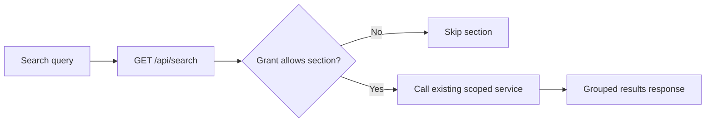

# RBAC Design

## Principle

The backend is the source of truth for authorization. Frontend route guards improve navigation and reduce dead-end clicks, but they do not replace server-side enforcement.

## Role Model

| Role | Primary business responsibility |
| --- | --- |
| `admin` | Enterprise governance, user management, full operational visibility |
| `officer` | Day-to-day asset program operations across departments |
| `manager` | Department-level oversight and approval |
| `employee` | Self-service requester and assignee |
| `technician` | Maintenance and support-focused operations |
| `auditor` | Verification and discrepancy investigation |

## Grant Domains

The backend exposes grants such as:

- `dashboard.read`
- `assets.read`
- `assets.manage`
- `assignments.read`
- `borrows.read`
- `borrows.request`
- `borrows.approve`
- `verification.read`
- `verification.manage`
- `discrepancies.read`
- `discrepancies.manage`
- `maintenance.read`
- `maintenance.manage`
- `disposal.read`
- `disposal.manage`
- `reports.read`
- `users.manage`
- `reference.read`
- `reference.manage`
- `notifications.read`
- `profile.read`

## Enforcement Layers

### Endpoint-level protection

- All API routes except login require authentication.
- Controller-level grant checks ensure feature-level access.

### Service-level scope protection

- Services apply record-specific rules such as:
  - manager department scope
  - employee self-ownership
  - technician maintenance scope
  - campaign department membership

This second layer is essential because "can open the module" is not the same as "can access every record inside the module".

## Role-to-Feature Matrix

| Capability | Admin | Officer | Manager | Employee | Technician | Auditor |
| --- | --- | --- | --- | --- | --- | --- |
| View dashboard | Yes | Yes | Yes | Yes | Yes | Yes |
| View assets | Yes | Yes | Department | Scoped | Broad support scope | Yes |
| Manage assets | Yes | Yes | No | No | No | No |
| View assignments | Yes | Yes | Department | Own | No | No |
| View borrow requests | Yes | Yes | Department | Own | No | Yes |
| Create borrow request | Yes | Yes | Yes | Yes | No | No |
| Approve borrow request | Yes | Yes | Department | No | No | No |
| View verification | Yes | Yes | Department campaigns | No | No | Yes |
| Manage verification | Yes | Yes | No | No | No | Yes |
| View discrepancies | Yes | Yes | Department | No | No | Yes |
| Manage discrepancies | Yes | Yes | No | No | No | Yes |
| View maintenance | Yes | Yes | Department | Assigned asset only | Own or department-related | No |
| Manage maintenance | Yes | Yes | No | No | Yes | No |
| View disposal | Yes | Yes | Department | No | No | No |
| Manage disposal | Yes | Yes | Department | No | No | No |
| View reports | Yes | Yes | Yes | No | No | Yes |
| Manage users | Yes | No | No | No | No | No |
| View notifications | Yes | Yes | Yes | Yes | Yes | Yes |
| Edit own profile | Yes | Yes | Yes | Yes | Yes | Yes |

## Scope Rules Backed by Current Services

| Module | Scope rule implemented |
| --- | --- |
| Assets | Department, assignee, and borrowable visibility rules |
| Assignments | Destination user/department scope |
| Borrow requests | Request ownership, department scope, or broad reviewer visibility |
| Verification | Campaign department membership for managers; broad read for auditors/officers/admins |
| Discrepancies | Department scope for managers; broad manage for auditors/officers/admins |
| Maintenance | Technician assignment/department relation, department scope, or assigned asset ownership |
| Disposal | Department scope for managers, broad scope for officers/admins |
| Reports | Broad but still filtered by visible entity IDs where relevant |

## Search and RBAC

The search feature does not create a parallel security model. Instead:

- the endpoint is authenticated
- section inclusion is gated by grants
- each underlying service still applies its normal record-level scope checks
- users therefore cannot discover records through search that they could not see elsewhere

## Why This Design Fits the System

- It matches the real operational responsibilities implied by the workflows.
- It keeps the frontend pleasant to use without trusting it with final authority.
- It avoids a heavyweight ACL subsystem while still supporting department and ownership scope.
- It keeps dashboards, search, and reports consistent with the same authorization logic used by the transactional flows.
