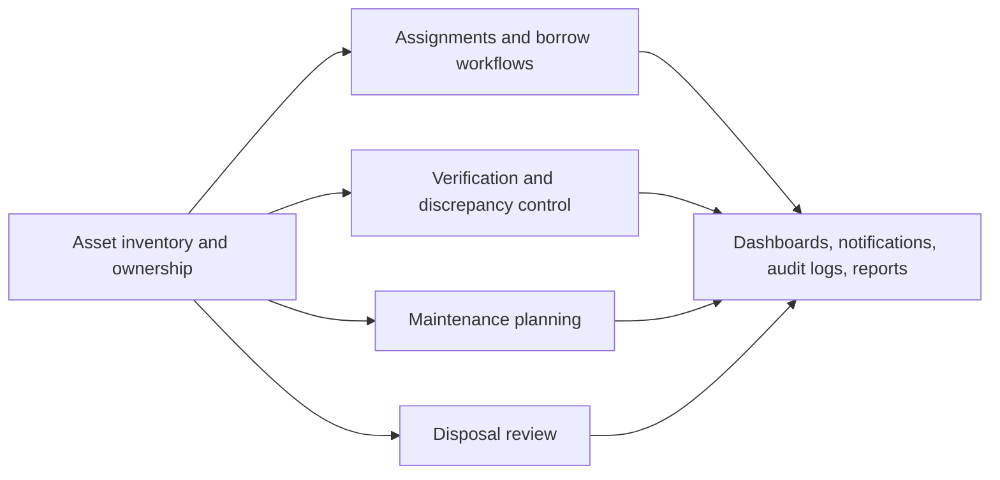

# Software Overview

## Product Summary

Asset Resolve is a role-based asset lifecycle platform for organizations that need more than a generic CRUD inventory. It combines asset inventory, ownership tracking, borrowing, verification campaigns, discrepancy handling, maintenance, disposal, notifications, reporting, and admin governance inside one RBAC-aware workflow system.

The system is designed for demoability and delivery realism:

- seeded reference data and demo accounts support walkthroughs and automated tests
- backend-owned authorization protects data scope and workflow actions
- Flyway, Docker, GitHub Actions, and Playwright support repeatable local and CI execution
- documentation is structured as a real team handoff rather than a minimal project note

## Business Context

Organizations with shared equipment typically struggle with three connected problems:

1. Asset inventory becomes stale because location, assignee, and condition drift over time.
2. Approval-heavy workflows such as borrowing, verification, discrepancy investigation, and disposal are tracked outside the system.
3. Roles such as admins, officers, managers, technicians, auditors, and employees need different visibility, but access rules become inconsistent when enforced only in the UI.

Asset Resolve addresses those problems by centering the system on assets and attaching operational workflows directly to those assets.

## Solution Scope

The implemented product scope includes:

- authentication, session restore, password change, and profile management
- role-aware dashboards and navigation
- asset registration, editing, deletion, and detail views
- assignment history and transfer visibility
- borrow request creation, approval, rejection, and status tracking
- verification campaign creation and campaign visibility
- discrepancy review with reconciliation, escalation, and maintenance handoff
- maintenance scheduling and technician assignment
- disposal request review and completion
- user-specific notifications
- reporting and audit visibility
- admin user management and reference data maintenance
- header-driven backend search across accessible modules

## Actor Model

| Actor | Primary goal in the system |
| --- | --- |
| Admin | Govern users, data, and enterprise-wide workflows |
| Officer | Operate the asset program across departments |
| Manager | Approve and supervise department-scoped activity |
| Employee | Request, view, and use assets within self-service limits |
| Technician | Execute maintenance and review support-related assets |
| Auditor | Run verification work and investigate discrepancies |

## Core Functional Requirements

The following requirements define the current delivery:

1. Users must authenticate before protected routes and APIs are accessible.
2. Backend authorization must remain the source of truth for every read and write action.
3. Asset records must carry category, department, location, assignee, condition, and lifecycle details.
4. Borrow, verification, discrepancy, maintenance, and disposal workflows must remain tied to concrete asset records.
5. Visibility must vary by role and scope, not just by feature flag.
6. Notifications and audit history must preserve operational traceability.
7. The top-bar search must trigger real backend results and honor RBAC.
8. Local development must be repeatable with PostgreSQL, Flyway, Vite, and documented ports.

## Functional Boundaries

The system intentionally focuses on operational lifecycle management rather than broader ERP concerns.

Included:

- inventory operations
- workflow approvals
- verification control
- maintenance coordination
- disposal review
- RBAC-aware reporting and search

Not included in the current implementation:

- barcode scanning hardware integration
- procurement and purchase-order workflows
- SSO/identity-provider integration
- binary file/document management
- multi-tenant organization partitioning

## Assumptions and Constraints

- PostgreSQL is the target database in local, CI-backed integration testing, and realistic deployment scenarios.
- Flyway migrations are the schema source of truth.
- Demo data remains part of the project because it supports seeded tests, smoke checks, and portfolio demonstrations.
- The product should remain practical and review-friendly; this phase avoids a UI redesign.
- The frontend may hide routes or actions for usability, but the backend must still reject unauthorized access.
- The deployment model assumes the frontend may run either same-origin behind a reverse proxy or separately from the backend with `VITE_API_BASE_URL`.

## Non-Functional Requirements

| Area | Requirement |
| --- | --- |
| Security | JWT auth, backend-enforced RBAC, no reliance on frontend-only authorization |
| Maintainability | Explicit service/controller separation, minimal configuration magic, small focused remediation |
| Portability | Local defaults for `5173` and `8080`, env-driven API/base-path/backend config, documented deployment variables |
| Testability | Unit, integration, frontend component, and Playwright smoke coverage wired into CI |
| Onboarding | Fresh developers should be able to run the project from README and docs without guessing |
| Auditability | Critical workflow changes should generate notifications and audit entries where implemented |

## Delivery Highlights in This Hardening Phase

- The frontend/backend dev port collision was resolved by moving Vite to `5173` and keeping Spring Boot on `8080`.
- The top search bar now submits to a real `/search` flow backed by `GET /api/search`.
- Frontend API and router behavior now support `VITE_API_BASE_URL` and `VITE_APP_BASE_PATH` for split-host and sub-path deployments.
- Backend configuration now supports `DB_HOST`, `DB_PORT`, `DB_NAME`, and `JWT_ALLOW_DEMO_SECRET` in addition to the existing full-URL overrides.
- A production profile now disables demo-secret usage unless an explicit JWT secret is supplied.
- CI now validates backend tests, frontend unit tests, frontend build output, and Playwright smoke coverage.
