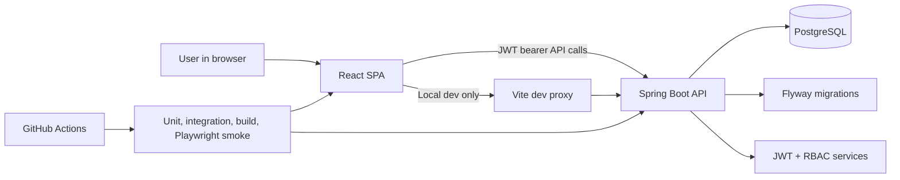
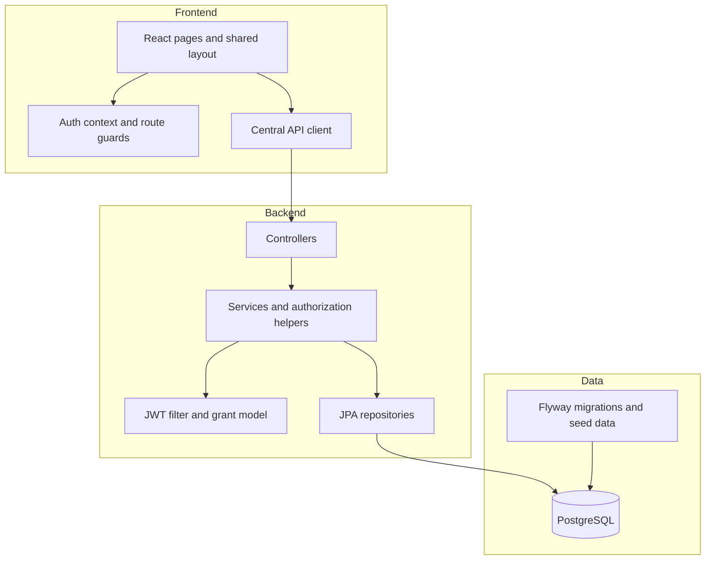
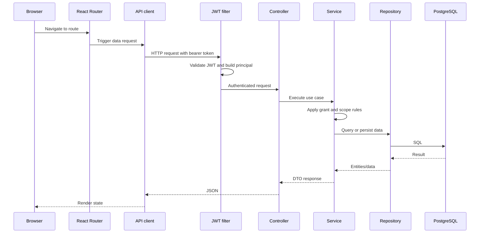
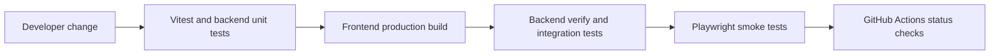

# System Architecture

## System Context

## Container View

## Frontend Structure

### Key building blocks

- `src/App.tsx`
  Defines the route tree, protected routes, grant checks, and the router basename used for sub-path deployments.
- `src/components/AppLayout.tsx`
  Provides the shared application shell.
- `src/components/AppHeader.tsx`
  Contains the top search bar and now submits real queries to the search route.
- `src/pages/*`
  Holds module-specific screens for dashboards, workflows, admin, and profile views.
- `src/contexts/AuthContext.tsx`
  Stores the authenticated session and exposes current-user/grant helpers.
- `src/lib/api.ts`
  Centralizes fetch logic, auth headers, error handling, and module endpoints.
- `src/lib/env.ts`
  Normalizes `VITE_API_BASE_URL` and `VITE_APP_BASE_PATH` so local dev and deployment builds use consistent rules.

### Why this frontend shape fits

- Route-level pages keep business features understandable without introducing a heavier state framework.
- The top-bar search integrates as a regular routed page instead of special modal-only state.
- Centralized env handling makes split-host and sub-path deployments practical without rewriting the app.

## Backend Layering

### Layer responsibilities

- `controller/`
  Request mapping, request param handling, and endpoint-level guards.
- `service/`
  Business rules, scope filtering, workflow validation, audit coordination, and search aggregation.
- `security/`
  JWT token creation/validation, authenticated principal creation, and grant derivation.
- `repository/`
  JPA persistence and query execution.
- `mapper/`
  DTO shaping so entities are not exposed directly.
- `dto/`
  Stable request/response contracts used by the client.

### Why this backend shape fits

- Workflow-heavy business logic stays out of controllers.
- Authorization remains reusable across services and tests.
- Search can reuse existing list/query services instead of creating a second rule engine.

## Request Lifecycle

## Security and Authorization Design

- Login returns a JWT plus authenticated user data and grant strings.
- The SPA stores the session client-side for UX, but all API authorization remains on the server.
- Spring Security protects all routes except login.
- Service-level authorization checks handle scope decisions that depend on department, assignee, or workflow ownership.
- The new search endpoint is authenticated and queries only sections allowed by the user's grants.

## API Interaction Model

### Local development

- Frontend runs on `http://localhost:5173`
- Backend runs on `http://localhost:8080`
- Vite proxies `/api/*` to the backend to avoid hardcoding localhost inside app logic

### Split-host or container deployment

- When the frontend is hosted separately from the backend, set `VITE_API_BASE_URL` to the backend public origin.
- When the app is deployed under a sub-path, set `VITE_APP_BASE_PATH`.
- Backend CORS must include the frontend origin through `CORS_ALLOWED_ORIGINS`.

## Configuration Separation

| Concern | Local default | Deployment override |
| --- | --- | --- |
| Frontend API origin | same-origin with Vite proxy | `VITE_API_BASE_URL` |
| Frontend base path | `/` | `VITE_APP_BASE_PATH` |
| Backend port | `8080` | `SERVER_PORT` |
| Database location | `localhost:5432/asset_management` | `DB_URL` or `DB_HOST` + `DB_PORT` + `DB_NAME` |
| JWT secret | demo value allowed locally | `JWT_SECRET` and `JWT_ALLOW_DEMO_SECRET=false` |
| CORS origins | local frontend origins | `CORS_ALLOWED_ORIGINS` |

## Database and Migration Model

- PostgreSQL is the primary relational store.
- Flyway migrations define schema and seed data.
- Hibernate validates schema compatibility on startup.
- Integration tests use Testcontainers so backend verification runs against real PostgreSQL behavior.

## Test and Delivery Architecture

- Frontend unit tests cover auth, route guards, dashboard rendering, and header search behavior.
- Backend unit and integration tests cover authorization, workflow rules, seeded RBAC, and API-level behavior.
- Playwright smoke tests cover the login path, scoped assets, admin user access, and the new top-bar search flow.

## Deployment Fit

This architecture is appropriate for the project because it keeps the system conventional, explicit, and deployable:

- Spring Boot handles RBAC-heavy workflow logic in a familiar enterprise stack.
- PostgreSQL cleanly models asset-centric relational workflows.
- React + Vite keeps the UI modular without adding unnecessary architectural weight.
- Env-based frontend API/base-path settings and backend datasource/JWT settings make the stack portable across local, CI, and hosted environments.
