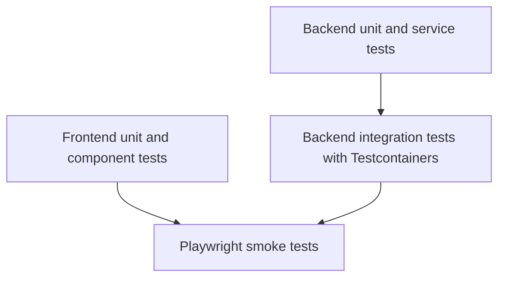
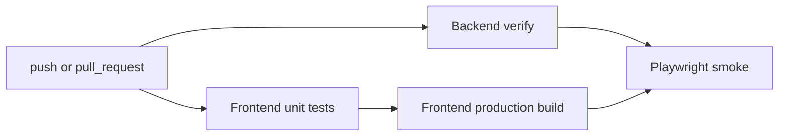

# Test Strategy and Coverage

## Quality Goals

The project test strategy is built around four objectives:

1. catch RBAC regressions early
2. protect core workflow behavior
3. validate that the seeded demo environment remains usable
4. keep CI actionable for push and pull request checks

## Test Pyramid

## Suite Inventory

| Suite | Primary location | Runtime model | Main purpose |
| --- | --- | --- | --- |
| Backend unit/service tests | `backend/src/test/java/.../service`, `.../security` | JUnit 5 + Mockito | Validate business rules, grants, and workflow logic quickly |
| Backend integration tests | `backend/src/test/java/.../controller` | Spring Boot + MockMvc + Testcontainers + Flyway | Verify endpoint behavior, security, seeded data, and PostgreSQL-backed integration |
| Frontend unit/component tests | `frontend/src/**/*.test.ts(x)` | Vitest + Testing Library | Verify auth context, route guards, UI interactions, and API client behavior |
| Frontend production build check | `npm --prefix frontend run build` | Vite production build | Catch deployment-breaking build/config issues |
| E2E smoke tests | `frontend/e2e/smoke.spec.ts` | Playwright + Docker-backed full stack | Validate critical user journeys end-to-end |
| Expanded local E2E suite | `frontend/e2e/*.spec.ts` | Playwright | Broader exploratory coverage when needed outside CI |

## Coverage Focus by Layer

### Backend unit and service tests

Coverage emphasis:

- permission grants
- authorization rules
- borrow workflow validation
- discrepancy and verification logic
- auth/profile/user-management behavior

Why it matters:

- these tests protect the densest business logic at the fastest feedback layer

### Backend integration tests

Coverage emphasis:

- login and session bootstrap
- admin-only endpoint protection
- dashboard scoping
- borrow workflow API behavior
- notification and verification integration
- global search RBAC behavior

Why it matters:

- these tests verify that controllers, security, services, Flyway data, and PostgreSQL all work together

### Frontend unit/component tests

Coverage emphasis:

- auth context persistence and logout behavior
- route guard redirects
- login page interactions
- dashboard rendering
- API client token handling
- top search navigation

Why it matters:

- they catch frontend regressions without requiring the full stack

### E2E smoke tests

Coverage emphasis:

- employee-scoped asset visibility
- admin-only user management access
- top-bar search returning real grouped results

Why it matters:

- these are high-value flows that prove the app is wired correctly across browser, frontend, backend, database, and seed data

## Critical Flows Protected Today

| Flow | Protection type |
| --- | --- |
| login and invalid login handling | backend tests, frontend tests, E2E |
| admin-only user management | backend integration, E2E |
| department-scoped visibility | backend integration, Playwright |
| employee asset restrictions | backend scope logic, Playwright smoke |
| borrow request creation and review | backend unit/integration, broader E2E |
| top-bar search to real results | frontend component test, backend integration, Playwright smoke |
| seeded demo accounts | integration tests and smoke suite |

## RBAC Verification Strategy

RBAC is tested across more than one layer on purpose:

- backend integration tests log in as different seeded roles and assert correct `200`, `403`, or scoped payload behavior
- frontend tests verify route-guard and UI-visibility expectations
- Playwright smoke confirms that visible UI paths and actual backend responses stay aligned

This layered approach matters because frontend-only tests cannot prove server enforcement, and backend-only tests cannot prove that users can still complete the intended journeys.

## CI Quality Gates

Current GitHub Actions gates:

- Backend Tests: `./backend/mvnw -f backend/pom.xml verify`
- Frontend Unit Tests: `npm --prefix frontend run test:unit`
- Frontend Build: `npm --prefix frontend run build`
- End-to-End Smoke Tests: `npm --prefix frontend run test:e2e`

## Traceability Examples

| Requirement | Primary tests |
| --- | --- |
| Only admins manage users | backend integration, Playwright smoke |
| Employees see only in-scope assets | authorization tests, dashboard scope tests, Playwright smoke |
| Search respects grants and uses real data | backend search integration test, AppHeader test, Playwright smoke |
| Local/deployment config should still build | frontend production build in CI and local build verification |
| Demo accounts and seed workflows must stay usable | integration tests and smoke checks |

## How to Run the Suites

- Backend unit tests: `npm run test:backend`
- Backend integration tests: `npm run test:backend:integration`
- Frontend unit tests: `npm run test:frontend`
- Frontend production build: `npm --prefix frontend run build`
- E2E smoke tests: `npm run test:e2e`
- Full E2E suite: `npm --prefix frontend run test:e2e:full`
- Full verification sweep: `npm run test:all`

## Known Gaps and Practical Limits

- The CI suite intentionally uses smoke E2E coverage rather than the full Playwright set to keep checks reliable.
- Not every page interaction is covered end-to-end yet; the current priority is auth, RBAC, and high-value workflows.
- The Vite production build warns about a large bundle chunk; this is a performance optimization opportunity rather than a build blocker.
