# Use Case Specification

## Scope

This document describes the major business capabilities implemented in Asset Resolve. Each use case is mapped to the real role model, backend authorization rules, and persisted data structures already present in the application.

## Actors

| Actor | Description | Typical system goals |
| --- | --- | --- |
| Admin | Enterprise-wide governance user | Manage users, supervise all workflows, read reports, keep master data clean |
| Officer | Operational asset controller | Manage assets, handle borrow/disposal workflows, coordinate maintenance |
| Manager | Department approver | Review department activity, approve requests, monitor team assets |
| Employee | Standard requester/assignee | See assigned assets, request borrowable equipment, track own activity |
| Technician | Support operations role | Review maintenance workload, inspect or repair assigned assets |
| Auditor | Control and verification specialist | Create campaigns, review tasks, investigate discrepancies |

## Use Case Landscape

```mermaid
flowchart LR
    Admin((Admin))
    Officer((Officer))
    Manager((Manager))
    Employee((Employee))
    Technician((Technician))
    Auditor((Auditor))

    Login[Authenticate and restore session]
    Dashboard[View role-aware dashboard]
    AssetRead[Browse and inspect assets]
    AssetManage[Create, update, delete assets]
    Assignments[Review assignment history]
    BorrowCreate[Create borrow request]
    BorrowReview[Approve or reject borrow request]
    Verification[Create or review verification campaign]
    Discrepancy[Investigate discrepancy]
    Maintenance[Create or manage maintenance record]
    Disposal[Review disposal request]
    Notifications[Review notifications]
    Profile[Maintain own profile]
    Users[Manage users]
    Reports[View reports and audit logs]
    Search[Search accessible records]

    Admin --> Login
    Officer --> Login
    Manager --> Login
    Employee --> Login
    Technician --> Login
    Auditor --> Login

    Admin --> Dashboard
    Officer --> Dashboard
    Manager --> Dashboard
    Employee --> Dashboard
    Technician --> Dashboard
    Auditor --> Dashboard

    Admin --> AssetRead
    Officer --> AssetRead
    Manager --> AssetRead
    Employee --> AssetRead
    Technician --> AssetRead
    Auditor --> AssetRead

    Admin --> AssetManage
    Officer --> AssetManage
    Admin --> Assignments
    Officer --> Assignments
    Manager --> Assignments
    Employee --> Assignments

    Admin --> BorrowCreate
    Officer --> BorrowCreate
    Manager --> BorrowCreate
    Employee --> BorrowCreate

    Admin --> BorrowReview
    Officer --> BorrowReview
    Manager --> BorrowReview

    Admin --> Verification
    Officer --> Verification
    Manager --> Verification
    Auditor --> Verification

    Admin --> Discrepancy
    Officer --> Discrepancy
    Manager --> Discrepancy
    Auditor --> Discrepancy

    Admin --> Maintenance
    Officer --> Maintenance
    Manager --> Maintenance
    Employee --> Maintenance
    Technician --> Maintenance

    Admin --> Disposal
    Officer --> Disposal
    Manager --> Disposal

    Admin --> Notifications
    Officer --> Notifications
    Manager --> Notifications
    Employee --> Notifications
    Technician --> Notifications
    Auditor --> Notifications

    Admin --> Profile
    Officer --> Profile
    Manager --> Profile
    Employee --> Profile
    Technician --> Profile
    Auditor --> Profile

    Admin --> Users
    Admin --> Reports
    Officer --> Reports
    Manager --> Reports
    Auditor --> Reports

    Admin --> Search
    Officer --> Search
    Manager --> Search
    Employee --> Search
    Technician --> Search
    Auditor --> Search
```

## UC-01 Authenticate and Start a Session

**Purpose**  
Allow a user with valid credentials to enter the application and receive the grants required for route-level UX and backend API access.

**Actors**  
All roles.

**Trigger**  
User opens `/login`, submits credentials, or refreshes a session that still has a stored token.

**Preconditions**

- The account exists.
- The account is active.
- The backend is reachable.

**Main success flow**

1. User submits username and password.
2. Backend validates the credentials and account status.
3. Backend issues a JWT and returns the authenticated user plus role-derived grants.
4. Frontend stores the token and session payload.
5. Frontend navigates to the dashboard route.
6. Subsequent API calls include the bearer token.

**Alternate flows**

- A stored token is reused and `/api/auth/me` rebuilds the session after refresh.
- The user later changes their password through the authenticated password-change flow.

**Exception flows**

- Invalid credentials return `401`.
- Inactive users are denied login.
- Expired or invalid stored tokens trigger session clearing and redirect to login.

**Validations and business rules**

- Username and password are required.
- Tokens are stateless and time-bound.
- Frontend session restoration improves UX but does not bypass backend authentication.

**Authorization and role restrictions**

- All roles may attempt login.
- Only active accounts can establish a usable session.

**Data affected**

- `users.last_login_at`
- JWT response payload returned to the client

**Postconditions**

- Authenticated routes and APIs become available according to grant scope.

## UC-02 View the Role-Aware Dashboard

**Purpose**  
Provide a current operational snapshot that is filtered to the caller's role and scope.

**Actors**  
Admin, Officer, Manager, Employee, Technician, Auditor.

**Trigger**  
Authenticated user lands on `/`.

**Preconditions**

- User is authenticated.
- User has `dashboard.read`.

**Main success flow**

1. Frontend requests dashboard data.
2. Backend resolves the current user and scope.
3. Dashboard metrics, deadlines, tasks, and recent activity are assembled.
4. Frontend renders cards and quick actions that match the role's visible modules.

**Alternate flows**

- Managers see department-filtered workload.
- Employees see self-relevant information rather than enterprise totals.

**Exception flows**

- Missing authentication redirects to login.
- Users lacking dashboard access are blocked by route and backend checks.

**Validations and business rules**

- Dashboard content is descriptive, not authoritative; underlying modules still enforce scope.
- Counts must reflect real accessible records rather than global totals.

**Authorization and role restrictions**

- Every current role can read the dashboard, but scope differs by department, assignment, or workflow ownership.

**Data affected**

- Read-only access across assets, workflows, notifications, and audit activity.

**Postconditions**

- User has an informed starting point for the modules they can act on next.

## UC-03 Browse the Asset Catalog

**Purpose**  
Allow users to search, filter, and inspect assets within their permitted visibility scope.

**Actors**  
Admin, Officer, Manager, Employee, Technician, Auditor.

**Trigger**  
User opens `/assets` or navigates to an asset detail page.

**Preconditions**

- User is authenticated.
- User has `assets.read`.

**Main success flow**

1. User opens the Assets page.
2. Frontend submits optional search and filter values.
3. Backend filters the asset list by role, department, assignee, and borrowability rules.
4. User reviews list results and opens asset detail when needed.
5. Detail view exposes related lifecycle and ownership information.

**Alternate flows**

- Admins, officers, auditors, and technicians receive broad read visibility.
- Managers see department-scoped assets.
- Employees see assets assigned to them and department borrowable inventory they are allowed to request.

**Exception flows**

- No matching assets produce an empty state.
- Direct navigation to an inaccessible asset detail returns a forbidden/not-found style failure.

**Validations and business rules**

- Asset detail must remain consistent with department, category, location, assignee, and lifecycle state.
- Filtering cannot expand visibility beyond what backend scope rules permit.

**Authorization and role restrictions**

- Read visibility is role-dependent and asset-specific.

**Data affected**

- Primarily `assets`, with supporting reads from `departments`, `locations`, `asset_categories`, and `users`.

**Postconditions**

- User can identify asset ownership, condition, and current lifecycle status for visible records.

## UC-04 Create, Update, or Delete an Asset

**Purpose**  
Maintain accurate asset master data for the inventory system.

**Actors**  
Admin, Officer.

**Trigger**  
Authorized user opens `/assets/new`, `/assets/:id/edit`, or invokes asset deletion.

**Preconditions**

- User is authenticated.
- User has `assets.manage`.
- Required reference data exists.

**Main success flow**

1. User enters or updates asset details.
2. Frontend submits the asset payload.
3. Backend validates identifiers, references, and business rules.
4. Asset is created or updated.
5. Audit logging records the operation.

**Alternate flows**

- Edit flow loads existing data before save.
- Delete flow removes an asset only when the record is eligible for deletion.

**Exception flows**

- Duplicate asset code or serial number is rejected.
- Missing category, department, or location is rejected.
- Assets tied to active workflow records cannot be deleted.

**Validations and business rules**

- Unique business identifiers are enforced.
- Lifecycle and borrowability should match operational reality.
- Deletion is intentionally conservative to preserve workflow integrity.

**Authorization and role restrictions**

- Only Admin and Officer can create, update, or delete assets.

**Data affected**

- `assets`
- `audit_logs`

**Postconditions**

- The inventory catalog reflects the new or updated operational truth.

## UC-05 Review Assignment History

**Purpose**  
Expose who received an asset, from which department, and under what transfer type and status.

**Actors**  
Admin, Officer, Manager, Employee.

**Trigger**  
User opens `/assignments`.

**Preconditions**

- User is authenticated.
- User has `assignments.read`.

**Main success flow**

1. User searches or filters assignment history.
2. Backend applies scope rules based on role and destination ownership.
3. Frontend renders assignment rows including asset, destination user, department, and status.

**Alternate flows**

- Managers see assignments into their department.
- Employees see assignments to themselves.

**Exception flows**

- Unauthorized access returns `403`.
- No matching records produce an empty state.

**Validations and business rules**

- Assignment visibility follows destination ownership and department scope, not global history visibility.

**Authorization and role restrictions**

- Admin and Officer see all assignments.
- Manager sees department destination assignments.
- Employee sees only own destination assignments.

**Data affected**

- `assignments`
- `assets`
- `users`
- `departments`

**Postconditions**

- User understands how assets moved through the organization within their visibility boundary.

## UC-06 Create a Borrow Request

**Purpose**  
Allow request-capable users to request temporary use of a borrowable asset.

**Actors**  
Admin, Officer, Manager, Employee.

**Trigger**  
User opens the Borrow Requests page and submits a new request.

**Preconditions**

- User is authenticated.
- User has `borrows.request`.
- The chosen asset is visible and borrowable.

**Main success flow**

1. User selects an eligible asset.
2. User enters borrow date, return date, purpose, and optional notes.
3. Backend validates the request against lifecycle and scheduling rules.
4. Request is stored with a pending-style status.
5. Reviewers see the request in their scoped borrow list.

**Alternate flows**

- Officers and admins may create requests with broader asset visibility than employees.

**Exception flows**

- Non-borrowable assets are rejected.
- Requests that overlap active workflows or invalid dates are rejected.
- Unauthorized users receive `403`.

**Validations and business rules**

- Asset must be borrowable.
- Borrow and return dates must be sensible.
- Only request-capable roles can create requests.

**Authorization and role restrictions**

- Request creation is limited to Admin, Officer, Manager, and Employee.

**Data affected**

- `borrow_requests`
- `notifications` for reviewers where implemented
- `audit_logs`

**Postconditions**

- A reviewable borrow request exists in the workflow.

## UC-07 Approve or Reject a Borrow Request

**Purpose**  
Allow authorized reviewers to decide whether a borrow request may proceed.

**Actors**  
Admin, Officer, Manager.

**Trigger**  
Reviewer opens `/borrow-requests` and applies an approval or rejection action.

**Preconditions**

- Request exists.
- Request is still in a reviewable state.
- Reviewer can view the request.

**Main success flow**

1. Reviewer opens the borrow request list.
2. Reviewer selects a pending request.
3. Reviewer approves or rejects with optional notes.
4. Backend confirms that the reviewer is allowed to decide that request.
5. Backend updates status, reviewer information, decision time, and supporting notifications/audit entries.

**Alternate flows**

- Managers can review requests for their own department.
- Officers and admins can review across departments.

**Exception flows**

- Previously decided requests cannot be approved or rejected again.
- Out-of-scope reviewers receive `403`.

**Validations and business rules**

- Review is status-dependent.
- Department scope matters for managers.
- Requester and reviewer records are preserved for traceability.

**Authorization and role restrictions**

- Approvals are limited to Admin, Officer, and Manager with correct scope.

**Data affected**

- `borrow_requests`
- `notifications`
- `audit_logs`

**Postconditions**

- Request status changes to approved, rejected, or another workflow-appropriate state.

## UC-08 Create or Review a Verification Campaign

**Purpose**  
Coordinate formal verification work across one or more departments.

**Actors**  
Admin, Officer, Auditor, Manager.

**Trigger**  
User opens `/verification`.

**Preconditions**

- User is authenticated.
- Read or manage verification grant is present.

**Main success flow**

1. Verification-capable user creates a campaign with name, code, year, departments, and dates.
2. Backend validates uniqueness and campaign parameters.
3. Verification tasks are created for in-scope assets.
4. Campaign appears in the UI with progress and discrepancy counts.
5. Managers can review campaigns involving their department even when they cannot create them.

**Alternate flows**

- Read-only users review campaign progress and scoped tasks without creation authority.

**Exception flows**

- Duplicate campaign codes are rejected.
- Invalid date ranges or empty scope are rejected.

**Validations and business rules**

- At least one department must be selected.
- `dueDate` must not precede `startDate`.
- Campaign scope is modeled as a many-to-many relationship with departments.

**Authorization and role restrictions**

- Admin, Officer, and Auditor manage campaigns.
- Managers have scoped read-only visibility for campaigns involving their department.

**Data affected**

- `verification_campaigns`
- `verification_campaign_departments`
- `verification_tasks`

**Postconditions**

- Campaign and tasks exist for later verification activity and discrepancy creation.

## UC-09 Investigate a Discrepancy

**Purpose**  
Handle mismatches discovered during verification so the organization can reconcile inventory variance.

**Actors**  
Admin, Officer, Auditor, Manager.

**Trigger**  
User opens `/discrepancies` or follows a campaign result into discrepancy review.

**Preconditions**

- Discrepancy exists.
- User can view the discrepancy.

**Main success flow**

1. User reviews discrepancy type, expected value, observed value, severity, and campaign context.
2. Authorized user records root cause and chooses a next action.
3. Backend updates discrepancy status and persists supporting details.
4. If the action routes work to maintenance, a linked maintenance record can be created.

**Alternate flows**

- Managers may review department-scoped discrepancies without manage rights.
- Auditors, officers, and admins can progress discrepancy state.

**Exception flows**

- Invalid state transitions are rejected.
- Inconsistent rework on already resolved items is rejected.

**Validations and business rules**

- Discrepancy status transitions must remain consistent.
- Severity and type help determine urgency and downstream handling.

**Authorization and role restrictions**

- Admin, Officer, and Auditor manage discrepancies.
- Managers have read-only department-scoped visibility.

**Data affected**

- `discrepancies`
- `maintenance_records` when maintenance is spawned
- `audit_logs`

**Postconditions**

- Discrepancy is reconciled, escalated, or handed off for maintenance follow-up.

## UC-10 Create or Manage Maintenance Work

**Purpose**  
Track planned or corrective work against assets and assign responsibility to a technician.

**Actors**  
Admin, Officer, Technician, Manager, Employee.

**Trigger**  
User opens `/maintenance` or creates a new maintenance record.

**Preconditions**

- User is authenticated.
- Manage actions require `maintenance.manage`.

**Main success flow**

1. Authorized user creates a maintenance record for an asset.
2. Backend validates asset, technician assignee, dates, and status payload.
3. Maintenance record is stored and appears in the maintenance list.
4. Scoped users review the record based on role and asset ownership rules.

**Alternate flows**

- Technicians can manage their support workload.
- Employees may view maintenance relevant to assets assigned to them.

**Exception flows**

- Missing technician assignee or invalid dates are rejected.
- Unauthorized maintenance creation or updates return `403`.

**Validations and business rules**

- Maintenance is asset-linked.
- Priority, status, and technical condition express operational urgency and repair state.

**Authorization and role restrictions**

- Admin, Officer, and Technician manage maintenance.
- Managers read department assets.
- Employees read maintenance tied to their assigned assets.

**Data affected**

- `maintenance_records`
- `audit_logs`
- possible downstream dashboard/notification reads

**Postconditions**

- A support workflow record exists and is attributable to a responsible technician or creator.

## UC-11 Review a Disposal Request

**Purpose**  
Allow authorized reviewers to move an asset toward retirement in a controlled, auditable way.

**Actors**  
Admin, Officer, Manager.

**Trigger**  
User opens `/disposal` and reviews a disposal request.

**Preconditions**

- Disposal request exists.
- Reviewer can view the asset's department scope.

**Main success flow**

1. Reviewer reads the disposal request reason, estimated value, and supporting notes.
2. Reviewer approves, rejects, or defers the request.
3. Backend validates scope and current state.
4. Disposal status, reviewer metadata, and optional effective date are updated.

**Alternate flows**

- Managers act only within their department.
- Admins and Officers can act broadly.

**Exception flows**

- Unauthorized users receive `403`.
- Missing records or invalid state transitions are rejected.

**Validations and business rules**

- Disposal is tied directly to an asset.
- Review actions must preserve reviewer traceability.

**Authorization and role restrictions**

- Admin and Officer have broad disposal control.
- Manager has department-scoped disposal control.

**Data affected**

- `disposal_requests`
- related asset lifecycle state where applicable
- `audit_logs`

**Postconditions**

- Disposal workflow progresses toward completion or returns to review.

## UC-12 Review Notifications and Maintain Profile

**Purpose**  
Support personal operational follow-up and self-service account maintenance.

**Actors**  
All authenticated roles.

**Trigger**  
User opens `/notifications` or `/profile`.

**Preconditions**

- User is authenticated.

**Main success flow**

1. User opens notifications and reviews personal updates.
2. User marks one or all notifications as read.
3. User opens profile and updates phone or bio fields.
4. Backend persists self-owned changes.

**Alternate flows**

- Notifications may be empty for a user with no recent system events.

**Exception flows**

- Users cannot read or modify another user's notifications or profile.

**Validations and business rules**

- Notification ownership is always user-specific.
- Profile updates remain self-service only.

**Authorization and role restrictions**

- Available to all authenticated users, but only for self-owned data.

**Data affected**

- `notifications`
- `users`
- `audit_logs` for profile update

**Postconditions**

- Personal queue and profile details remain current.

## UC-13 Manage Users, Reports, and Global Search

**Purpose**  
Cover the platform-level administrative and discovery features used for governance and navigation.

**Actors**  
Admin for user management; Admin, Officer, Manager, Auditor for reports; all authenticated roles for global search within accessible scope.

**Trigger**  
User opens `/users`, `/reports`, or submits a query in the top search bar.

**Preconditions**

- User is authenticated.
- The relevant grant is present.

**Main success flow**

1. Admin searches, creates, updates, activates/deactivates, or resets user accounts.
2. Privileged users open reports and review summary metrics or audit logs.
3. Any authenticated user enters a top-bar search query and presses Enter or clicks search.
4. Frontend navigates to `/search?q=...`.
5. Backend aggregates grouped results only for modules the caller can access.

**Alternate flows**

- Password reset restores the documented demo default password.
- Search may return results from assets, users, borrow requests, assignments, maintenance, discrepancies, disposal, and verification depending on grants.

**Exception flows**

- Non-admin callers receive `403` for user management.
- Invalid user payloads return validation errors.
- Empty search terms are ignored safely.
- Search API failures render a visible error state rather than fake client-side results.

**Validations and business rules**

- Username and email uniqueness are enforced.
- User management is admin-only.
- Search is backed by real APIs and existing scoped services rather than a separate authorization model.

**Authorization and role restrictions**

- `users.manage` is admin-only.
- `reports.read` is limited to Admin, Officer, Manager, and Auditor.
- Search respects the module grants already assigned to the caller.

**Data affected**

- `users`
- `audit_logs`
- cross-module read access through search aggregation

**Postconditions**

- Governance actions, reporting visibility, and cross-module record discovery remain consistent with the same RBAC model used elsewhere in the system.
